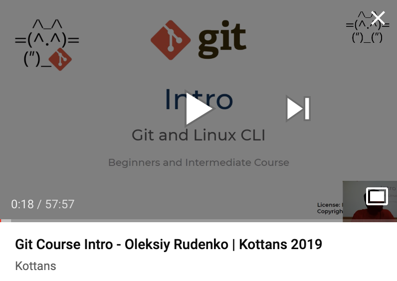

[![Kottans-Frontend][badge-kottans]][kottans-git]
[![MIT Licensed][badge-mit]][license]
![Entry level: beginner][badge-beginner]

# Git Course

This course is aimed at helping beginners in gaining basic yet minimally
required proficiency with Git and Linux CLI.

The course is based on the materials from
[kottans/frontend](https://github.com/kottans/frontend/blob/master/contents.md)
course and is intended to complement any courses for beginners.

<!-- START doctoc generated TOC please keep comment here to allow auto update -->
<!-- DON'T EDIT THIS SECTION, INSTEAD RE-RUN doctoc TO UPDATE -->
## Table of Contents

- [Course structure](#course-structure)
- [Learning hints](#learning-hints)
- [Extras](#extras)
- [What's next?](#whats-next)

<!-- END doctoc generated TOC please keep comment here to allow auto update -->
<!-- generated with [DocToc](https://github.com/thlorenz/doctoc) -->

## Course structure

Below is brief description of modules. You may skip any of the
modules whenever you feel confident with your skills a module
offers to master (as described in each module's **Targets**
section).

However, check the module contents and extra materials offered
therein before you decide to skip. You still may find something
new or useful.

1. [**Linux CLI**](./modules/linux-cli.md) - 
   basic skills working with Linux command line
   interface every developer needs to master
1. [**Git Basics**](./modules/git-basics.md) - 
   basic Git skills: maintain your code portfolio
   (`init, clone, add, commit, checkout, branch, merge, push, pull, fetch`)
1. [**Contributing with Git**](./modules/git-collaboration.md) - 
   working with a shared code base
   (remotes, sync up, revert changes, intro to GitHub)
1. [**Git workflow and GitHub**](./modules/git-workflow-github.md) - 
   collaborate with others
   efficiently minimizing code conflicts and delivering
   working code
   (issues, pull requests, code review, code conflict resolution)
1. [**Git workshop**](./modules/git-workshop.md) - 
   have a hands-on experience in collaborating with other developers,
   practising the most common collaboration cases. Bonus: tips and tricks

## Learning hints

Issues with English? Click to unfold

You may resort to subtitles/closed captions and
to auto-translated subtitles in particular if you feel
it would help you to master the video course better.

Employ Google Translate for textual materials.

## Extras

The video below offers an intro to the course (RUS).

---

If you find any topic not sufficiently disclosed just let us know by adding
[an issue](https://github.com/kottans/git-course/issues) with a proposal.
   
## What's next?

Here we go! [Start with Linux CLI](./modules/linux-cli.md)

---

[badge-kottans]: https://img.shields.io/badge/%3D(%5E.%5E)%3D-git-yellow.svg
[kottans-git]: https://github.com/kottans/git-course

[badge-mit]: https://img.shields.io/badge/License-MIT-blue.svg
[license]: https://github.com/kottans/git-course/blob/master/LICENSE.md

[badge-beginner]: https://img.shields.io/badge/Entry%20level-beginner-brightgreen.svg
