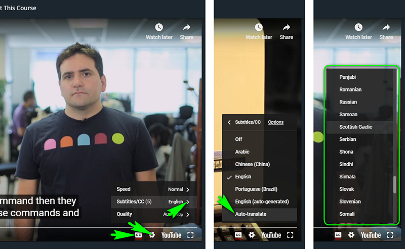

[![Kottans-Frontend][badge-kottans]][kottans-git]
[![MIT Licensed][badge-mit]][license]
![Entry level: beginner][badge-beginner]

# Git Course

This course is aimed at helping beginners in gaining basics proficiency
with git and Linux CLI (at capacity sufficient to support git operations).

The course is based on the materials from
[kottans/frontend](https://github.com/kottans/frontend/blob/master/contents.md)
course and is intended to complement Frontend and Backend courses.

<!-- START doctoc generated TOC please keep comment here to allow auto update -->
<!-- DON'T EDIT THIS SECTION, INSTEAD RE-RUN doctoc TO UPDATE -->
## Table of Contents

- [Course structure](#course-structure)
- [Learning hints](#learning-hints)

<!-- END doctoc generated TOC please keep comment here to allow auto update -->
<!-- generated with [DocToc](https://github.com/thlorenz/doctoc) -->

## Course structure

Below is brief description of modules. You may skip any of the
modules whenever you feel confident with your skills a module
would help to master.

However, check the module contents and extra materials offered
therein before you decide to skip. You still may find something
new or useful.

1. **Linux CLI** - basic skills working with Linux command line
   interface every developer needs to master
1. **Git Basics** - basic Git skills: maintain your code portfolio
1. **Contributing with Git** - working with a shared code base
1. **Git workflow and GitHub** - collaborate with others
   efficiently minimizing code conflicts and delivering
   working code
1. **Git workshop** - have a hands-on experience in
   collaborating with other developers, practising
   most common cases
   
You may skip any of the modules if you feel confident that 
you know well what is described in the module's **Targets**
section.

Check the module contents and extra materials 
before you decide to skip. You may find something new or useful.

## Learning hints

Issues with English? Click to unfold

You may resort to subtitles/closed captions and
to auto-translated subtitles in particular if you feel
it would help you to master the video course better.

Employ Google Translate for textual materials.

If you find some topic not sufficiently disclosed in any
materials, just, let us know.
   
---

Here we go! [Start with Linux CLI](./modules/linux-cli.md)

---

[badge-kottans]: https://img.shields.io/badge/%3D(%5E.%5E)%3D-git-yellow.svg
[kottans-git]: https://github.com/kottans/git-course

[badge-mit]: https://img.shields.io/badge/License-MIT-blue.svg
[license]: https://github.com/kottans/git-course/blob/master/LICENSE.md

[badge-beginner]: https://img.shields.io/badge/Entry%20level-beginner-brightgreen.svg
